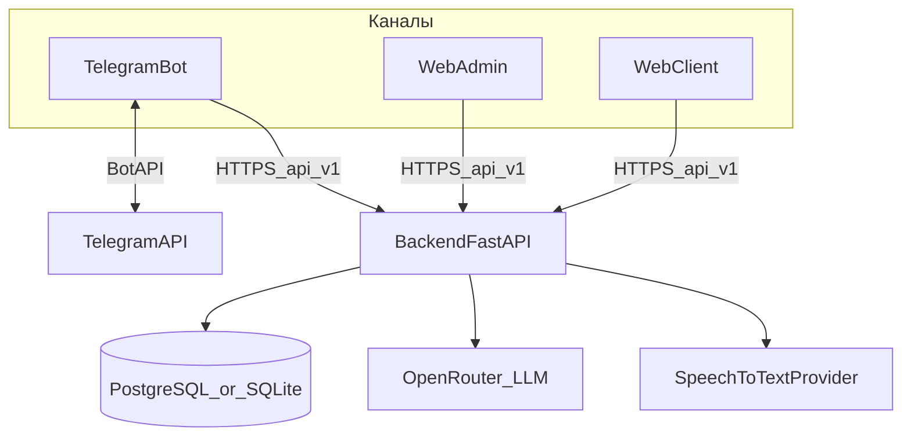
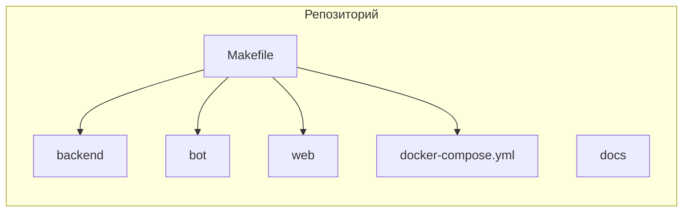
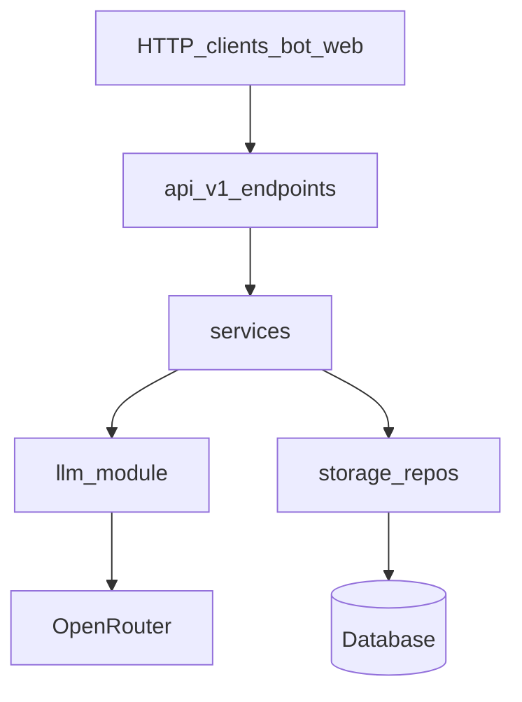
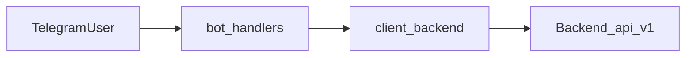
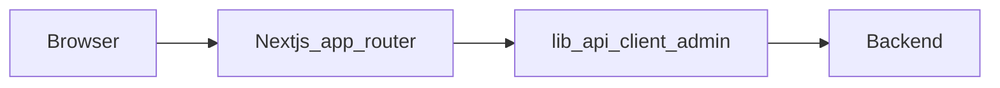
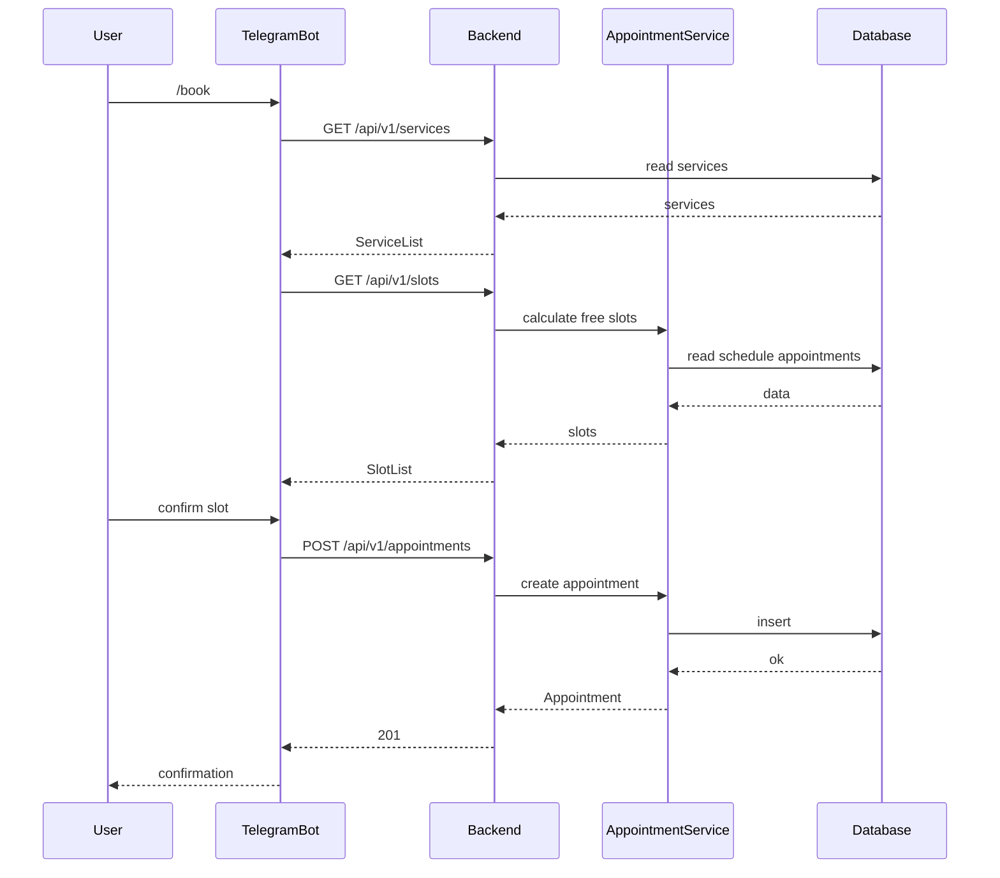
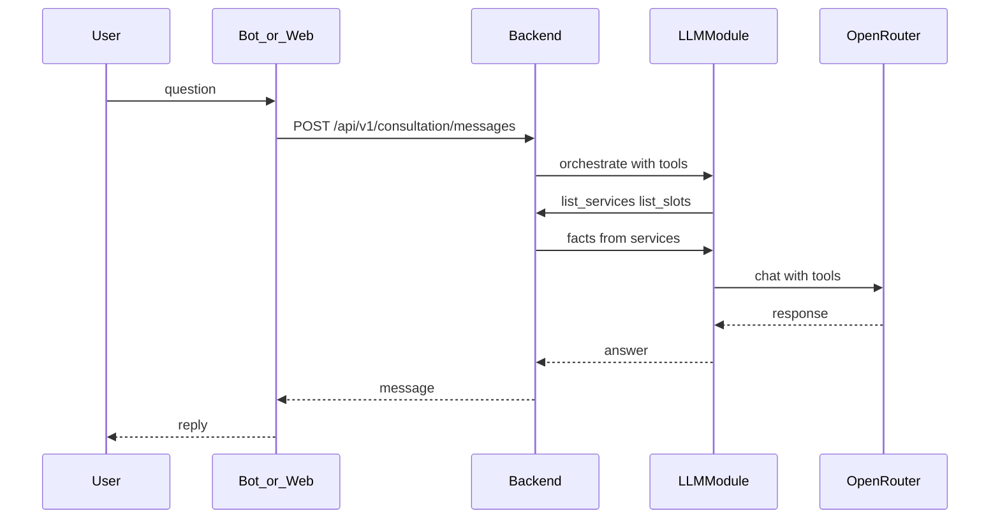

# Архитектура «Переобуйка»

Высокоуровневое описание системы. Детали продуктовых правил и стека — в [vision.md](vision.md); контракты HTTP — в [tech/api/](tech/api/); данные — в [tech/data-model.md](tech/data-model.md).

---

## Назначение

Единое ядро (**backend**) обслуживает каналы взаимодействия:

- **Telegram-бот** — приоритетный клиентский канал;
- **Web** (`web/`) — административный и клиентский интерфейсы в одном Next.js-проекте.

Бизнес-логика (слоты, прайс, записи, лояльность, консультация) сосредоточена в backend; бот и web — тонкие клиенты.

---

## Контекст системы

| Внешняя система | Кто вызывает | Назначение |
|-----------------|--------------|------------|
| Telegram Bot API | bot | Long polling, сообщения пользователю |
| OpenRouter (LLM) | backend | Консультация, function calling |
| OpenRouter / OpenAI (STT) | backend | Распознавание голоса (ADR-005) |

Интеграции подробнее: [tech/integrations.md](tech/integrations.md).

---

## Монорепозиторий

| Каталог | Стек | Роль |
|---------|------|------|
| `backend/` | Python 3.12, FastAPI, SQLAlchemy, Alembic, uv | Ядро, REST `/api/v1` |
| `bot/` | Python, aiogram 3, uv | Telegram-клиент |
| `web/` | Next.js App Router, React, TypeScript, pnpm, shadcn/ui | Web-клиент |
| `docs/` | Markdown | Vision, API, tasklists, ADR |

Локально PostgreSQL поднимается через `docker-compose.yml` (только БД); полный compose всех сервисов — этап 6 в [plan.md](plan.md).

---

## Backend: слои

| Слой | Путь | Ответственность |
|------|------|-----------------|
| API | `backend/src/pereobuyka/api/v1/` | HTTP, статусы, Pydantic-схемы, `Depends` |
| Services | `backend/src/pereobuyka/services/` | Бизнес-правила |
| LLM | `backend/src/pereobuyka/llm/` | Промпты, вызов модели, tools |
| Storage | `backend/src/pereobuyka/storage/` | Доступ к данным (PostgreSQL / memory для SQLite) |
| DB | `backend/src/pereobuyka/db/` | ORM, сессии |

Точка входа приложения: `backend/src/pereobuyka/main.py` — префикс API **`/api/v1`**, инфраструктура **`GET /health`**.

Группы маршрутов (см. [openapi.yaml](tech/api/openapi.yaml)):

- **Auth** — `POST /auth/telegram`, `POST /auth/web`
- **Публичное** — каталог услуг, слоты, создание записи (часть сценариев)
- **Client** — `/me`, записи, визиты, бонусы (Bearer JWT)
- **Admin** — `/admin/*` (Bearer `ADMIN_API_TOKEN` или JWT админа)
- **Consultation** — LLM-диалог для web и бота

---

## Bot: структура

| Путь | Назначение |
|------|------------|
| `bot/run_bot.py` | Локальный запуск (как `make bot-run`) |
| `bot/src/pereobuyka/main.py` | Сборка aiogram, polling |
| `bot/src/pereobuyka/bot/handlers/` | Команды и FSM |
| `bot/src/pereobuyka/client/backend.py` | HTTP к backend |

LLM и STT **не** вызываются напрямую из бота для консультации — только через backend (`/api/v1/consultation/messages`).

---

## Web: структура

| Путь | Назначение |
|------|------------|
| `web/app/` | Маршруты App Router (`/`, `/admin`, `/client`, …) |
| `web/components/` | UI, auth, app shell, чат |
| `web/lib/api.ts` | Базовый fetch, разбор ошибок |
| `web/lib/client-api.ts`, `admin-api.ts`, `consultation-api.ts` | Доменные вызовы API |

Конфиг: `NEXT_PUBLIC_API_BASE_URL` — origin backend **без** `/api/v1` (префикс добавляет клиент).

---

## Данные

- **Production-целевой** вариант: PostgreSQL (миграции Alembic, seed).
- **Локальный быстрый** вариант: SQLite-файл — ограниченный режим без полного набора admin/client маршрутов.

Модель: [tech/data-model.md](tech/data-model.md). Миграции: [tech/database-migrations.md](tech/database-migrations.md).

---

## Сквозной поток: запись через бота

---

## Сквозной поток: LLM-консультация

Модель получает факты только из backend (tools / контекст), не выдумывает цены и слоты — см. [vision.md](vision.md) §6.

---

## Архитектурные решения (ADR)

Ключевые ADR в [tech/adr/](tech/adr/):

| ADR | Тема |
|-----|------|
| adr-001 | Выбор СУБД |
| adr-002 | Backend framework |
| adr-003 | ORM |
| adr-004 | Workflow миграций |
| adr-005 | Speech-to-text |
| adr-006 | Text-to-SQL (админ-аналитика) |

---

## Дальше

- Онбординг и команды: [onboarding.md](onboarding.md)
- План этапов: [plan.md](plan.md)
- Известные расхождения docs ↔ code: [doc-audit.md](doc-audit.md)
