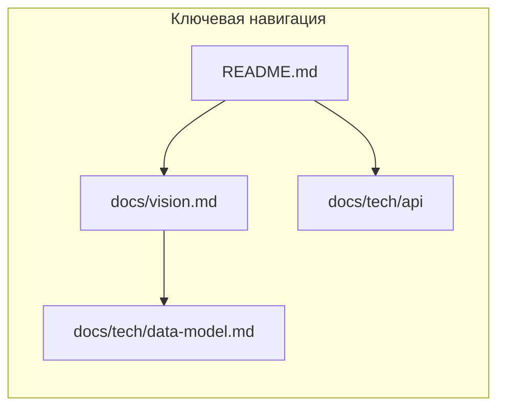

# Аудит документации «Переобуйка»

Кодовая база — монорепозиторий: [`backend/`](backend/), [`web/`](web/) (не `frontend/`), [`bot/`](bot/), корневой [`Makefile`](Makefile), [`docker-compose.yml`](docker-compose.yml).

---

## Шаг 1. Реестр документации

| Файл | Описание | Статус | Проблемы |
|------|----------|--------|----------|
| [README.md](README.md) | Точка входа: компоненты, требования (Python 3.12+, uv, Node 22+, pnpm, Docker, Make), ключи, быстрый старт backend/web/bот на Windows, IPv4 `127.0.0.1` | Актуально | В блоке «Документация» нет прямой ссылки на [docs/vision.md](docs/vision.md); нет одного последовательного «с нуля до smoke» (порядок: env → БД → migrate/seed → согласованные `BOT_SECRET`). |
| [backend/README.md](backend/README.md) | Backend: uv, `.env`, SQLite vs PostgreSQL, таблица `make db-*`, `/health` и Swagger, тесты (Docker + Testcontainers), структура пакета, ссылки на OpenAPI/контракты | Актуально | — |
| [web/README.md](web/README.md) | Шаблон create-next-app (npm/yarn/bun, Vercel) | Устарело | Не отражает монорепо: **pnpm**, `make web-install` / `web-dev`, [web/.env.example](web/.env.example), связь с API (`NEXT_PUBLIC_API_BASE_URL`). |
| [bot/README.md](bot/README.md) | Бот: `make bot-*`, lint/mypy, тесты, ссылка на backend | В целом актуально | Команда запуска `uv run python -m pereobuyka.main` расходится с корневым [`Makefile`](Makefile) (`run_bot.py`); функционально [run_bot.py](bot/run_bot.py) вызывает тот же `main`, но для новичка это путаница. |
| [docs/vision.md](docs/vision.md) | Архитектурное видение, границы системы, стек, слои, LLM-правила | Актуально | Длинный документ — для «за сеанс» полезна краткая навигация в корневом README (разделы §). |
| [docs/plan.md](docs/plan.md) | Дорожная карта этапов, статусы, ссылки на tasklist | Частично устарело | **Битые ссылки:** `tasks/tasklist-04-admin-web.md`, `tasklist-05-client-web.md`, `tasklist-06-devops.md` — файлов нет; фактически есть [docs/tasks/tasklist-frontend.md](docs/tasks/tasklist-frontend.md) и др. |
| [docs/data-model.md](docs/data-model.md) — путь `docs/tech/data-model.md` | Модель данных, сущности, связи | Актуально | Пользователь указал `docs/data-model.md`; реальный путь **docs/tech/data-model.md**. |
| [docs/tech/api/api-contracts.md](docs/tech/api/api-contracts.md) | Текстовые контракты REST, отсылка к OpenAPI | Актуально | Большой объём — норма для спеки. |
| [docs/tech/api/openapi.yaml](docs/tech/api/openapi.yaml) | Каноническая OpenAPI 3.0.3 | Актуально | Поддерживать синхронность с кодом — отдельная дисциплина (в реестре как риск дрейфа). |
| [docs/tech/api/errors.md](docs/tech/api/errors.md) | Модель ошибок API | Актуально | — |
| [docs/tech/api/README.md](docs/tech/api/README.md) | Индекс API-доков | Устарело | Фраза «Swagger UI **планируется** после каркаса FastAPI» не соответствует текущему backend (`/docs` описан в backend/README). |
| [.env.example](.env.example) (корень) | Указатель на `bot/` и `backend/` шаблоны | Актуально | Минималистично — ок как redirect. |
| [backend/.env.example](backend/.env.example) | Полный перечень переменных backend | Актуально | — |
| [bot/.env.example](bot/.env.example) | Переменные бота + подсказки по `BOT_SECRET` | Актуально | — |
| [web/.env.example](web/.env.example) | `NEXT_PUBLIC_API_BASE_URL` | Актуально | — |
| [Makefile](Makefile) | `backend-*`, `bot-*`, `web-*`, `db-*` | Актуально | `backend-stop` / привязка к порту 8000 — Windows-специфика задокументирована в backend/README. |
| [docker-compose.yml](docker-compose.yml) | Локальный PostgreSQL 16 | Актуально | — |
| [.cursor/rules/convensions.mdc](.cursor/rules/convensions.mdc) | Код-конвенции, ссылки на vision и skills | Актуально | Для людей вне Cursor менее видимо — можно дублировать кратко в CONTRIBUTING. |
| [.cursor/rules/workflow.mdc](.cursor/rules/workflow.mdc) | Процесс: tasklist, plan/summary в docs/tasks | Актуально | То же: ортогонально к «общему» CONTRIBUTING. |
| [skills-lock.json](skills-lock.json) + [.agents/skills/](.agents/skills/) | Зафиксированные навыки агентов (хэши, источники) | Актуально | Для AI-онбординга полезно кратко описать в корневом README или `docs/AGENTS.md`: что такое lock и какие skills обязательны под задачу. |
| [docs/tasks/tasklist-*.md](docs/tasks/) | Планирование по областям (backend, database, frontend, bot, …) | Актуально | Не совпадает с ожиданиями из plan.md (см. выше). |
| [docs/tech/integrations.md](docs/tech/integrations.md), [database-migrations.md](docs/tech/database-migrations.md), [docs/tech/adr/](docs/tech/adr/), [docs/backlog.md](docs/backlog.md), [docs/ui/ui-requirements.md](docs/ui/ui-requirements.md) | Интеграции, миграции, ADR, бэклог, UI | Актуально / контекстно | Для «первого сеанса» — вторичный слой после README + vision + API. |
| [oboarding_tobe.md](oboarding_tobe.md) (корень) | Общий чеклист «какой бывает документация» | Не проектный артефакт | Опечатка в имени; дублирует внешнюю рекомендацию, не привязан к репо — путает; лучше удалить или перенести в docs и переименовать. |
| CONTRIBUTING.md | Процесс PR, ветки, обязательные проверки | Отсутствует | Пробел для людей и агентов. |
| CI (GitHub Actions и т.п.) | Автопроверки | Отсутствует (`.github/` нет) | Нет «единого источника правды» для quality gates в CI. |

---

## Шаг 2. Аудит запускаемости

| Пункт | Статус | Где задокументировано / замечание |
|-------|--------|-------------------------------------|
| Установка системных зависимостей | **Есть** | [README.md](README.md): Python 3.12+, uv, Node 22+, pnpm, Docker, GNU Make. Нет отдельной секции «установка uv/pnpm на Windows» (ссылки на оф. сайты можно добавить). |
| Настройка окружения | **Есть** | Шаблоны `backend/`, `bot/`, `web/` + таблица в backend/README. Согласование `BOT_SECRET` между backend и bot явно в примерах, но **нет единого чеклиста** в корне. |
| Запуск БД | **Есть** | `make db-up`, [backend/README.md](backend/README.md), [docker-compose.yml](docker-compose.yml). |
| Запуск backend | **Есть** | `make backend-run`, Swagger/health в backend/README. |
| Запуск frontend | **Есть** в корне; **противоречие** в `web/README` | Корневой README достаточен; web/README вводит в заблуждение. |
| Запуск бота | **Есть** | `make bot-run`; мелкая несогласованность команды с bot/README. |
| Запуск тестов | **Частично** | Backend: `make backend-test` (+ Docker для Testcontainers) — описано. Bot: `make bot-test` — описано. **Web: скрипта `test` в [web/package.json](web/package.json) нет** — формально «тесты фронта» отсутствуют как команда. |
| Проверка работоспособности | **Частично** | `GET /health`, Swagger — в backend/README. Нет единого **smoke-списка** (например curl/OpenAPI + открытие `localhost:3000` + минимальный сценарий бота с токеном). |
| Проверка качества кода | **Есть** | `make backend-lint`, `make bot-lint`, `make web-lint` (+ `web-build` в корневом README). |

**Итог по цели «войти и за один сеанс всё понять»:** база сильная за счёт корневого README и backend/README; основные дыры — **навигация и консистентность** (vision, битые ссылки в plan.md, web/README, api/README), **отсутствие одного linear onboarding-чеклиста**, **нет web-тестов**, **нет CONTRIBUTING/CI**.

---

## Рекомендуемые следующие шаги (после подтверждения плана)

1. Исправить [docs/plan.md](docs/plan.md): заменить ссылки на несуществующие tasklist на реальные файлы или завести stub-файлы с перенаправлением.
2. Переписать [web/README.md](web/README.md) под монорепо (pnpm, make, env, ссылка на корневой README).
3. Обновить [docs/tech/api/README.md](docs/tech/api/README.md) — убрать устаревшее про «планируется Swagger».
4. Унифицировать команду запуска бота в [bot/README.md](bot/README.md) с Makefile (`run_bot.py` или пояснить оба варианта).
5. Расширить корневой README: ссылка на vision, секция «Первый запуск за N шагов» (env trio → `db-up` → migrate/seed → backend → web), smoke (`/health`, `/docs`).
6. Добавить [CONTRIBUTING.md](CONTRIBUTING.md) (ветки, обязательные `make *-lint`/pytest, отсылка к `.cursor/rules` для агентов).
7. Решить судьбу [oboarding_tobe.md](oboarding_tobe.md) (удалить/переименовать/вынести в docs).
8. Опционально: `npm test` / Playwright или хотя бы явная пометка «тестов web нет» в README, чтобы ожидания агента/человека совпадали с реальностью.
