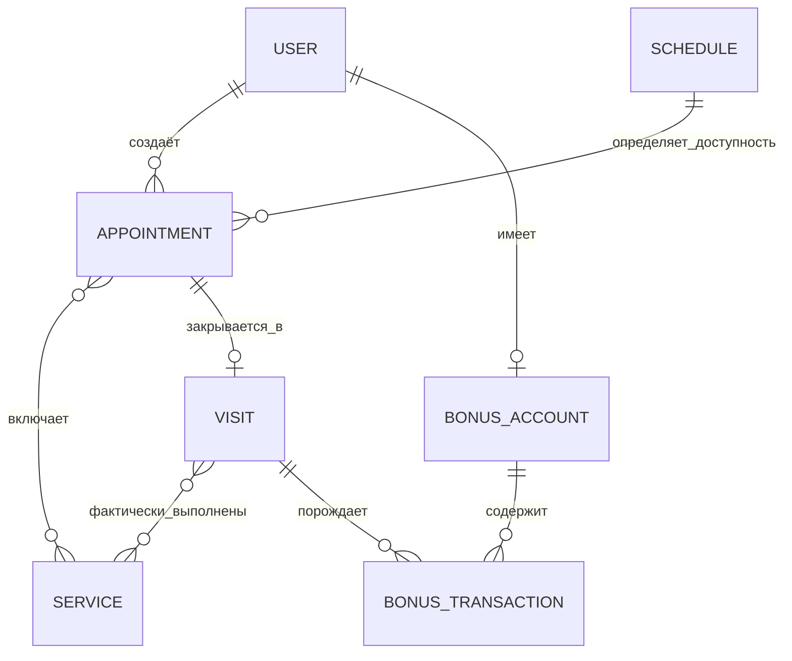

# Модель данных «Переобуйка»

Концептуальная модель: ключевые сущности, их назначение и связи.

---

## Основные сущности

### Пользователь `User`
Учётная запись в системе. Единая точка идентификации независимо от канала (бот или веб).

| Поле | Тип | Описание |
|------|-----|----------|
| `id` | UUID / int | Внутренний идентификатор |
| `name` | string | Имя (из профиля Telegram или введённое вручную) |
| `phone` | string | Контактный номер |
| `role` | enum | `client` или `admin` |
| `telegram_id` | int | ID пользователя в Telegram; null для веб-регистрации |
| `registered_at` | datetime | Дата и время регистрации |
| `source` | enum | Канал регистрации: `telegram` / `web` |

> При входе через веб без Telegram — идентификация по номеру телефона (метод уточняется).

---

### Услуга `Service`
Позиция прайс-листа. Основа для расчёта стоимости и длительности записи.

| Поле | Тип | Описание |
|------|-----|----------|
| `id` | UUID / int | Идентификатор |
| `name` | string | Название услуги |
| `description` | string | Краткое описание (для клиента и LLM-контекста) |
| `price` | decimal | Цена в рублях |
| `duration_minutes` | int | Норма времени на выполнение |
| `is_active` | bool | Отображается ли клиентам |

---

### Рабочее расписание `Schedule`
Описывает доступность сервиса. Используется при расчёте свободных слотов.

| Поле | Тип | Описание |
|------|-----|----------|
| `id` | UUID / int | Идентификатор |
| `weekday` | int / null | День недели (0–6); null для записей-исключений |
| `date` | date / null | Конкретная дата (для исключений) |
| `start_time` | time | Начало рабочего дня |
| `end_time` | time | Конец рабочего дня |
| `is_day_off` | bool | Выходной / нерабочий день |

> Базовый вариант: шаблон по дням недели + список исключений (праздники, внеплановые закрытия).

---

### Запись `Appointment`
Бронирование времени клиентом под конкретные услуги.

| Поле | Тип | Описание |
|------|-----|----------|
| `id` | UUID / int | Идентификатор |
| `user_id` | FK → User | Клиент |
| `starts_at` | datetime | Дата и время начала |
| `ends_at` | datetime | Расчётное время окончания (по сумме длительностей услуг) |
| `total_price` | decimal | Расчётная стоимость на момент записи |
| `status` | enum | `scheduled` / `completed` / `cancelled` |
| `created_at` | datetime | Дата создания записи |

> Связь с услугами — через промежуточную таблицу `AppointmentService` (many-to-many).

---

### Визит `Visit`
Факт оказанных услуг. Подтверждается администратором после обслуживания.

| Поле | Тип | Описание |
|------|-----|----------|
| `id` | UUID / int | Идентификатор |
| `appointment_id` | FK → Appointment | Исходная запись |
| `total_amount` | decimal | Итоговая сумма к оплате |
| `bonus_spent` | int | Списано бонусов |
| `bonus_earned` | int | Начислено бонусов |
| `confirmed_at` | datetime | Дата и время подтверждения |
| `confirmed_by` | FK → User | Администратор, закрывший визит |

> Фактический перечень услуг визита может отличаться от записи — через `VisitService` (many-to-many).

---

### Бонусный счёт `BonusAccount`
Накопительный баланс клиента.

| Поле | Тип | Описание |
|------|-----|----------|
| `id` | UUID / int | Идентификатор |
| `user_id` | FK → User | Владелец (уникален) |
| `balance` | int | Текущий баланс в бонусных единицах |

---

### Бонусная транзакция `BonusTransaction`
История изменений бонусного баланса.

| Поле | Тип | Описание |
|------|-----|----------|
| `id` | UUID / int | Идентификатор |
| `account_id` | FK → BonusAccount | Счёт |
| `type` | enum | `earn` (начисление) / `spend` (списание) / `adjust` (ручная правка) |
| `amount` | int | Количество бонусов |
| `visit_id` | FK → Visit / null | Связанный визит (если применимо) |
| `created_at` | datetime | Дата транзакции |
| `comment` | string | Комментарий (для ручных корректировок) |

---

### FAQ `FAQ`
База типовых вопросов и ответов. Источник контекста для LLM-компонента.

| Поле | Тип | Описание |
|------|-----|----------|
| `id` | UUID / int | Идентификатор |
| `question` | string | Формулировка вопроса |
| `answer` | string | Ответ |
| `is_active` | bool | Используется ли в LLM-контексте |

---

## Связи между сущностями

### Ключевые связи

| Связь | Описание |
|-------|----------|
| Пользователь → Запись | Один клиент может иметь несколько записей |
| Запись ↔ Услуга | Одна запись включает одну или несколько услуг |
| Запись → Визит | Каждая выполненная запись закрывается одним визитом |
| Визит ↔ Услуга | Фактические услуги визита могут отличаться от записи |
| Визит → Бонусная транзакция | После подтверждения визита начисляются бонусы |
| Пользователь → Бонусный счёт | У каждого клиента один счёт; транзакции ведут историю |
| Расписание → Запись | Расписание определяет доступные окна для бронирования |
