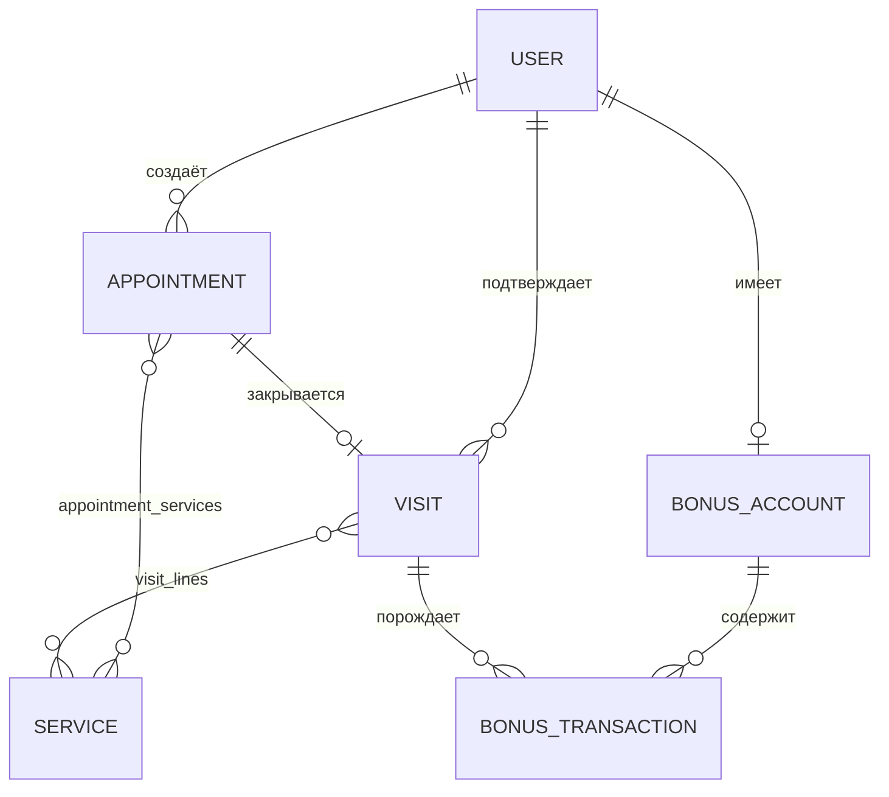
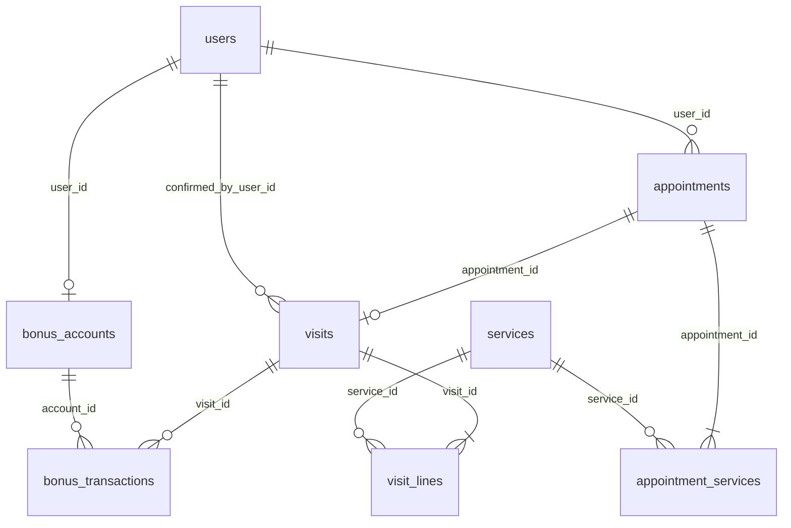

# Модель данных «Переобуйка»

Концептуальная и целевая **физическая** модель под PostgreSQL: сущности, связи, таблицы и ограничения.

Продуктово-ориентированные требования по сценариям: [user_scenarios.md](user_scenarios.md). Публичные поля и идентификаторы в HTTP API: [openapi.yaml](api/openapi.yaml), [api-contracts.md](api/api-contracts.md).

---

## Логическая модель

Идентификаторы сущностей в API — **UUID** (строка в JSON). Внутри БД — тип `UUID`.

### Пользователь `User`

Учётная запись в системе; единая идентификация независимо от канала (бот или веб).

| Поле | Тип | Описание |
|------|-----|----------|
| `id` | UUID | Первичный ключ |
| `name` | string | Имя |
| `phone` | string / null | Телефон |
| `role` | enum | `client` \| `admin` |
| `telegram_id` | int64 / null | ID в Telegram; у веб-клиента без Telegram — null |
| `registered_at` | datetime | Регистрация |
| `source` | enum | `telegram` \| `web` |

Связи: один `User` с ролью `client` имеет много `Appointment`; не более одного `BonusAccount` (по `user_id`).

---

### Услуга `Service`

Позиция прайса; основа для длительности и стоимости записи/визита.

| Поле | Тип | Описание |
|------|-----|----------|
| `id` | UUID | Первичный ключ |
| `name` | string | Название |
| `description` | string | Описание (клиент, LLM) |
| `price` | decimal | Цена в рублях |
| `duration_minutes` | int | Норма времени, мин |
| `is_active` | bool | Видимость в каталоге для клиента |

---

### Правило расписания `ScheduleRule`

Шаблон доступности по **дню недели** (контракт API — отдельный ресурс от исключений).

| Поле | Тип | Описание |
|------|-----|----------|
| `id` | UUID | Первичный ключ |
| `weekday` | int | 0 — понедельник … 6 — воскресенье |
| `start_time` | time | Начало рабочего окна |
| `end_time` | time | Конец рабочего окна |
| `is_day_off` | bool | Выходной в этот день недели |

---

### Исключение расписания `ScheduleException`

Переопределение на **конкретную дату** (праздник, сокращённый день и т.д.).

| Поле | Тип | Описание |
|------|-----|----------|
| `id` | UUID | Первичный ключ |
| `date` | date | Календарная дата |
| `start_time` | time | Начало окна |
| `end_time` | time | Конец окна |
| `is_day_off` | bool | Нерабочий день целиком / только окно |

Расчёт слотов учитывает и правила, и исключения (см. бизнес-логику backend).

---

### Запись `Appointment`

Бронирование времени клиентом; набор услуг с количествами (как `ServiceLineItem` в API).

| Поле | Тип | Описание |
|------|-----|----------|
| `id` | UUID | Первичный ключ |
| `user_id` | FK → User | Клиент |
| `starts_at` | datetime | Начало |
| `ends_at` | datetime | Конец (по сумме длительностей) |
| `total_price` | decimal | Стоимость на момент записи |
| `status` | enum | `scheduled` \| `completed` \| `cancelled` |
| `created_at` | datetime | Создание записи |

Связь с услугами: таблица **appointment_services** (`appointment_id`, `service_id`, `quantity`).

---

### Визит `Visit`

Факт оказания услуг по записи; подтверждается администратором.

| Поле | Тип | Описание |
|------|-----|----------|
| `id` | UUID | Первичный ключ |
| `appointment_id` | FK → Appointment | Исходная запись (1:1 на уровне домена: один визит на запись) |
| `total_amount` | decimal | Итог к оплате |
| `bonus_spent` | int | Списано бонусов |
| `bonus_earned` | int | Начислено бонусов |
| `confirmed_at` | datetime | Подтверждение |
| `confirmed_by_user_id` | FK → User | Администратор (поле API `confirmed_by_user_id`) |

Фактические услуги: **visit_lines** (`visit_id`, `service_id`, `quantity`).

---

### Бонусный счёт `BonusAccount`

| Поле | Тип | Описание |
|------|-----|----------|
| `id` | UUID | Первичный ключ |
| `user_id` | FK → User | Владелец; один счёт на клиента |
| `balance` | int | Текущий баланс |

---

### Бонусная транзакция `BonusTransaction`

| Поле | Тип | Описание |
|------|-----|----------|
| `id` | UUID | Первичный ключ |
| `account_id` | FK → BonusAccount | Счёт |
| `type` | enum | `earn` \| `spend` \| `adjust` |
| `amount` | int | Величина; по контракту API допускается знак (начисление/списание), согласовано с типом |
| `visit_id` | FK → Visit / null | Связь с визитом при необходимости |
| `created_at` | datetime | Время |
| `comment` | string / null | Для `adjust` |

---

### FAQ `FAQ`

Справочник для LLM-контекста.

| Поле | Тип | Описание |
|------|-----|----------|
| `id` | UUID | Первичный ключ |
| `question` | string | Вопрос |
| `answer` | string | Ответ |
| `is_active` | bool | Участие в выдаче контекста |

---

### Правила лояльности (singleton)

В API: схема `LoyaltyRules` (чтение). В БД удобно хранить как **одну строку** настроек (`max_bonus_spend_percent`, `earn_percent_after_visit`).

---

## Связи между сущностями (логическая диаграмма)

| Связь | Описание |
|-------|----------|
| User → Appointment | Один клиент — много записей |
| Appointment ↔ Service | Через appointment_services с quantity |
| Appointment → Visit | Не более одного визита на запись (MVP) |
| Visit ↔ Service | Через visit_lines; может отличаться от записи |
| User → BonusAccount | Один счёт на клиента |
| BonusAccount → BonusTransaction | История движений |
| ScheduleRule / ScheduleException | Не FK от записи; влияют на расчёт доступных слотов |

---

## Физическая модель (PostgreSQL)

Соглашения:

- Имена таблиц и колонок — `snake_case`.
- Время событий — `TIMESTAMPTZ`; даты календаря — `DATE`; время суток в правилах — `TIME` (без timezone, как в контракте).
- Деньги — `NUMERIC(12, 2)`; не `money`, не float.
- Строки — тип **`TEXT`** (не `VARCHAR(n)`); верхняя граница длины задаётся **`CHECK (char_length(столбец) <= N)`** (см. таблицы ниже). Для nullable полей: `CHECK (столбец IS NULL OR char_length(столбец) <= N)`. Так задаётся предсказуемый потолок без смены типа колонки при увеличении лимита.
- Первичные ключи сущностей — `UUID` с `DEFAULT gen_random_uuid()` (расширение `pgcrypto` или встроенная функция в зависимости от версии PG).
- Внешние ключи: явные `ON DELETE` / `ON UPDATE` по смыслу; на **каждую** колонку FK — **B-дерево** (PostgreSQL не создаёт автоматически).

### `users`

| Колонка | Тип | Ограничения |
|---------|-----|-------------|
| `id` | UUID | PK, `DEFAULT gen_random_uuid()` |
| `name` | TEXT | NOT NULL, `CHECK (char_length(name) <= 200)` |
| `phone` | TEXT | NULL, `CHECK (phone IS NULL OR char_length(phone) <= 32)` |
| `role` | TEXT | NOT NULL, CHECK в (`client`, `admin`), `CHECK (char_length(role) <= 16)` |
| `telegram_id` | BIGINT | NULL; при необходимости уникальность не-null значений — частичный UNIQUE индекс |
| `registered_at` | TIMESTAMPTZ | NOT NULL, DEFAULT `now()` |
| `source` | TEXT | NOT NULL, CHECK в (`telegram`, `web`), `CHECK (char_length(source) <= 16)` |

Индексы: по необходимости уникальности `telegram_id` для зарегистрированных через Telegram.

### `services`

| Колонка | Тип | Ограничения |
|---------|-----|-------------|
| `id` | UUID | PK |
| `name` | TEXT | NOT NULL, `CHECK (char_length(name) <= 255)` |
| `description` | TEXT | NOT NULL, `CHECK (char_length(description) <= 4000)` |
| `price` | NUMERIC(12,2) | NOT NULL, CHECK `>= 0` |
| `duration_minutes` | INTEGER | NOT NULL, CHECK `> 0` |
| `is_active` | BOOLEAN | NOT NULL, DEFAULT true |

### `schedule_rules`

| Колонка | Тип | Ограничения |
|---------|-----|-------------|
| `id` | UUID | PK |
| `weekday` | SMALLINT | NOT NULL, CHECK 0–6 |
| `start_time` | TIME | NOT NULL |
| `end_time` | TIME | NOT NULL |
| `is_day_off` | BOOLEAN | NOT NULL |

Рекомендуется UNIQUE (`weekday`) для одного шаблона на день недели; если допускается несколько сегментов в день — без UNIQUE, сортировка по времени в приложении.

### `schedule_exceptions`

| Колонка | Тип | Ограничения |
|---------|-----|-------------|
| `id` | UUID | PK |
| `exception_date` | DATE | NOT NULL |
| `start_time` | TIME | NOT NULL |
| `end_time` | TIME | NOT NULL |
| `is_day_off` | BOOLEAN | NOT NULL |

UNIQUE (`exception_date`) при одном исключении на дату.

### `appointments`

| Колонка | Тип | Ограничения |
|---------|-----|-------------|
| `id` | UUID | PK |
| `user_id` | UUID | NOT NULL, FK → `users(id)` |
| `starts_at` | TIMESTAMPTZ | NOT NULL |
| `ends_at` | TIMESTAMPTZ | NOT NULL |
| `total_price` | NUMERIC(12,2) | NOT NULL |
| `status` | TEXT | NOT NULL, CHECK в (`scheduled`, `completed`, `cancelled`), `CHECK (char_length(status) <= 32)` |
| `created_at` | TIMESTAMPTZ | NOT NULL, DEFAULT `now()` |

CHECK `ends_at > starts_at`. Индексы: `user_id`; опционально по диапазону `starts_at` для слотов и журнала.

### `appointment_services`

| Колонка | Тип | Ограничения |
|---------|-----|-------------|
| `appointment_id` | UUID | NOT NULL, FK → `appointments(id)` ON DELETE CASCADE |
| `service_id` | UUID | NOT NULL, FK → `services(id)` |
| `quantity` | INTEGER | NOT NULL, CHECK `>= 1` |

PK (`appointment_id`, `service_id`). Индекс на `service_id` для отчётов.

### `visits`

| Колонка | Тип | Ограничения |
|---------|-----|-------------|
| `id` | UUID | PK |
| `appointment_id` | UUID | NOT NULL UNIQUE, FK → `appointments(id)` |
| `total_amount` | NUMERIC(12,2) | NOT NULL |
| `bonus_spent` | INTEGER | NOT NULL, DEFAULT 0, CHECK `>= 0` |
| `bonus_earned` | INTEGER | NOT NULL, DEFAULT 0, CHECK `>= 0` |
| `confirmed_at` | TIMESTAMPTZ | NOT NULL |
| `confirmed_by_user_id` | UUID | NOT NULL, FK → `users(id)` |

### `visit_lines`

| Колонка | Тип | Ограничения |
|---------|-----|-------------|
| `visit_id` | UUID | NOT NULL, FK → `visits(id)` ON DELETE CASCADE |
| `service_id` | UUID | NOT NULL, FK → `services(id)` |
| `quantity` | INTEGER | NOT NULL, CHECK `>= 1` |

PK (`visit_id`, `service_id`).

### `bonus_accounts`

| Колонка | Тип | Ограничения |
|---------|-----|-------------|
| `id` | UUID | PK |
| `user_id` | UUID | NOT NULL UNIQUE, FK → `users(id)` |
| `balance` | INTEGER | NOT NULL, DEFAULT 0 |

### `bonus_transactions`

| Колонка | Тип | Ограничения |
|---------|-----|-------------|
| `id` | UUID | PK |
| `account_id` | UUID | NOT NULL, FK → `bonus_accounts(id)` |
| `type` | TEXT | NOT NULL, CHECK в (`earn`, `spend`, `adjust`), `CHECK (char_length(type) <= 16)` |
| `amount` | INTEGER | NOT NULL |
| `visit_id` | UUID | NULL, FK → `visits(id)` |
| `created_at` | TIMESTAMPTZ | NOT NULL, DEFAULT `now()` |
| `comment` | TEXT | NULL, `CHECK (comment IS NULL OR char_length(comment) <= 1000)` |

Индексы: `account_id`; `visit_id` (если выборки по визиту).

### `faq_entries`

| Колонка | Тип | Ограничения |
|---------|-----|-------------|
| `id` | UUID | PK |
| `question` | TEXT | NOT NULL, `CHECK (char_length(question) <= 500)` |
| `answer` | TEXT | NOT NULL, `CHECK (char_length(answer) <= 16000)` |
| `is_active` | BOOLEAN | NOT NULL, DEFAULT true |

### `loyalty_settings`

Одна строка глобальных настроек (согласовано с `GET` правил лояльности в API).

| Колонка | Тип | Ограничения |
|---------|-----|-------------|
| `id` | SMALLINT | PK, CHECK `= 1` (singleton) |
| `max_bonus_spend_percent` | SMALLINT | NOT NULL, CHECK 0–100 |
| `earn_percent_after_visit` | SMALLINT | NOT NULL, CHECK 0–100 |

---

## ER-диаграмма (физическая)

Имена сущностей — как таблицы; связи — FK.

Таблицы `schedule_rules`, `schedule_exceptions`, `loyalty_settings`, `faq_entries` на диаграмме не соединены FK с записями — связь с расписанием **вычислительная** (слоты).

---

## Согласование с OpenAPI и заметки

| Тема | Статус |
|------|--------|
| Длина строк в JSON | В [openapi.yaml](api/openapi.yaml) для перечисленных полей **`maxLength` не задан**; лимиты заданы только в модели БД выше. При реализации **iter-db-05** рекомендуется добавить те же ограничения в **Pydantic** (и при согласовании контракта — `maxLength` в OpenAPI), чтобы некорректная длина отсекалась ответом **422** до записи в БД |
| Идентификаторы UUID | Совпадают с `format: uuid` в схемах |
| Расписание | В OpenAPI — `ScheduleRule` и `ScheduleException`; физически — `schedule_rules`, `schedule_exceptions` |
| Цены и суммы | API — десятичные **строки** в JSON; в БД — `NUMERIC` |
| Строки записи/визита | `ServiceLineItem` с `quantity` → `appointment_services`, `visit_lines` |
| Поле подтверждения визита | В API `confirmed_by_user_id` → колонка `confirmed_by_user_id` |
| Транзакции бонусов | Семантика знака `amount` в API должна быть отражена в сервисном слое и CHECK при необходимости |
| FAQ | В текущем OpenAPI нет отдельных путей для CRUD FAQ — таблица `faq_entries` на будущее и для LLM; при появлении эндпоинтов схемы дополняются |
| Консультации LLM | `request_id` в ответе — опционально отдельная таблица логов вне scope текущей схемы |

Правки контрактов при реализации персистентного слоя — по мере необходимости в **iter-db-05** и отдельных задачах backend.

Первая миграция Alembic (см. [ADR-004](adr/adr-004-database-migrations-workflow.md), [database-migrations.md](database-migrations.md)) должна воспроизвести перечисленные **`CHECK` по длине** в DDL вместе с остальными ограничениями таблиц.
