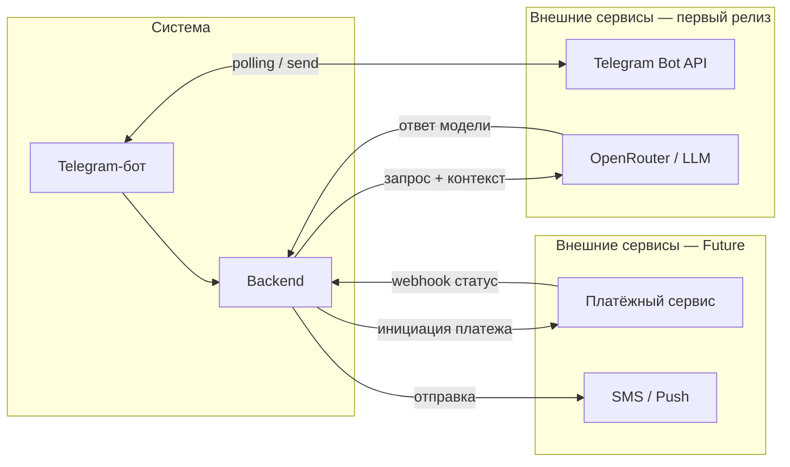

# Внешние интеграции «Переобуйка»

Все внешние интеграции проходят через backend. Бот и веб-приложение — внутренние клиенты системы, не внешние интеграции.

---

## Backend REST API

Публичный HTTP-интерфейс ядра для **Telegram-бота**, **веб-клиента** и **админки**: единая точка бизнес-логики и данных. Вызовы идут по **HTTPS** на backend (базовый путь `**/api/v1`**).

| Аспект             | Описание                                                                                                               |
| ------------------ | ---------------------------------------------------------------------------------------------------------------------- |
| Контракт           | Канонически — [api/openapi.yaml](api/openapi.yaml); текстовый обзор — [api/api-contracts.md](api/api-contracts.md)     |
| Ошибки             | [api/errors.md](api/errors.md)                                                                                         |
| Аутентификация     | После `POST /api/v1/auth/telegram` — заголовок `Authorization: Bearer <JWT>` для защищённых маршрутов                  |
| Публичные маршруты | Каталог услуг, свободные слоты, правила лояльности — без токена (см. OpenAPI)                                          |
| Клиент             | `/api/v1/me`, записи, визиты, бонусы, создание записи, консультация (LLM)                                              |
| Администратор      | Префикс `/api/v1/admin/...` — услуги, расписание (правила и исключения), журнал записей, подтверждение визитов, бонусы |

Краткая карта методов и путей — в [api-contracts.md](api/api-contracts.md). Уведомления пользователю в Telegram (напоминания, статусы) реализуются через **Telegram Bot API** от бота/сервиса и **не дублируются** отдельным REST-ресурсом (см. раздел ниже).

---

## Внешние системы

### Telegram Bot API

[core.telegram.org/bots/api](https://core.telegram.org/bots/api)

| Параметр    | Значение                                                                           |
| ----------- | ---------------------------------------------------------------------------------- |
| Назначение  | Канал взаимодействия с клиентами: приём сообщений, отправка ответов, inline-кнопки |
| Направление | Bidirectional: бот получает апдейты (polling) и отправляет сообщения               |
| Протокол    | HTTPS / Telegram Bot API; aiogram 3.x                                              |
| Критичность | **Критично для первого релиза** — без этого нет первого канала                      |

---

### OpenRouter (LLM-провайдер)

[openrouter.ai](https://openrouter.ai)

| Параметр    | Значение                                                                                                        |
| ----------- | --------------------------------------------------------------------------------------------------------------- |
| Назначение  | Консультационные диалоги: ответы на вопросы клиентов об услугах, ценах, записи — на основе контекста от backend |
| Направление | Out: backend формирует запрос с контекстом → получает ответ модели                                              |
| Протокол    | HTTPS / OpenAI-совместимый API (`openai` SDK, кастомный `base_url`)                                             |
| Критичность | **Критично для консультационного контура** — без LLM нет консультационного диалога                              |

> Модель задаётся строкой в конфигурации и может меняться без правок кода. Провайдер (OpenRouter) выбран как агрегатор: при необходимости модель или провайдер меняется в конфиге.

---

### Облачный speech-to-text (STT) для голоса в бота

Решение и провайдеры: [ADR-005](adr/adr-005-speech-to-text.md).

| Параметр    | Значение |
| ----------- | -------- |
| Назначение  | Распознавание голосовых сообщений Telegram в текст перед вызовом LLM-консультации |
| Направление | Out: backend пересылает аудио провайдеру STT → получает текст |
| Протокол    | По умолчанию **OpenRouter** — `POST …/audio/transcriptions`, JSON + base64 ([документация STT](https://openrouter.ai/docs/api/api-reference/stt/create-audio-transcriptions)); опционально **openai_multipart** для прямого OpenAI-совместимого multipart |
| Критичность | **Опционально** — без настроенного STT голос в боте недоступен, текст работает |

Для STT (голос в Telegram): **`SPEECH_TO_TEXT_PROVIDER`**, **`SPEECH_TO_TEXT_API_KEY`**, **`SPEECH_TO_TEXT_BASE_URL`** (для OpenRouter обычно совпадает с **`OPENROUTER_BASE_URL`**; пусто — подставляется из **`OPENROUTER_BASE_URL`**), **`SPEECH_TO_TEXT_MODEL`**. Ключ **`OPENROUTER_API_KEY`** — **только** для LLM-консультации. Режим `openai_multipart`: те же три `SPEECH_TO_TEXT_*`, база часто `https://api.openai.com/v1`, модель часто `whisper-1`.

---

### Платёжный сервис *(планируется)*

*Конкретный провайдер не выбран: ЮKassa, Tinkoff и др.*

| Параметр    | Значение                                                              |
| ----------- | --------------------------------------------------------------------- |
| Назначение  | Онлайн-оплата услуг при записи или после визита                       |
| Направление | Bidirectional: backend инициирует платёж → получает webhook о статусе |
| Протокол    | HTTPS / REST; webhook для подтверждений                               |
| Критичность | **Future** — вне текущего scope                                       |

---

### SMS / Push-уведомления *(планируется)*

*Конкретный провайдер не выбран: SMSC, СМС.ру и др.*

| Параметр    | Значение                                       |
| ----------- | ---------------------------------------------- |
| Назначение  | Напоминания о записи для клиентов без Telegram |
| Направление | Out: backend отправляет сообщение              |
| Протокол    | HTTPS / REST                                   |
| Критичность | **Future**                                     |

---

## Диаграмма

---

## Зависимости и риски

| Интеграция           | Риск                                                  | Митигация                                                                                      |
| -------------------- | ----------------------------------------------------- | ---------------------------------------------------------------------------------------------- |
| **Telegram Bot API** | Блокировка или недоступность Telegram                 | Веб-интерфейс как резервный канал; retry-логика в боте                                         |
| **OpenRouter / LLM** | Деградация качества ответов, таймауты, рост стоимости | Fallback: понятное сообщение пользователю без ответа LLM; модель меняется в конфиге без деплоя |
| **OpenRouter / LLM** | Смена провайдера или модели                           | Провайдер и модель изолированы в конфиге и LLM-модуле; смена — без правок бизнес-логики        |
| **Платёжный сервис** | Зависимость от регуляторных требований РФ             | Выбор провайдера — отдельное решение; интерфейс изолируется от конкретики                      |

**Ключевой принцип:** все внешние зависимости изолированы в отдельных модулях backend. Смена провайдера или протокола не затрагивает бизнес-логику.