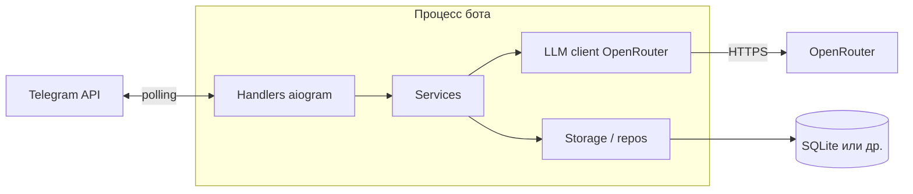

# Техническое видение проекта

Документ описывает целевой стек, принципы разработки, структуру репозитория, архитектуру, модель данных, работу с LLM, пользовательские сценарии, конфигурирование и логирование. Ориентир: **KISS**, **YAGNI**, **DRY**, ООП с правилом **один класс — один файл**, без оверинжиниринга.

---

## 1. Технологии

| Область | Выбор |
|--------|--------|
| Язык | Python 3.12+ (минимальная версия фиксируется в `pyproject.toml`) |
| Виртуальное окружение | `venv` (стандартная библиотека), каталог `.venv` в корне проекта |
| Зависимости и lock | **uv** — `pyproject.toml` + lock-файл; установка через `uv sync` |
| LLM | Официальный пакет **openai** (OpenAI Python SDK), endpoint провайдера **OpenRouter** (`base_url`, `api_key`) |
| Telegram | **aiogram** 3.x, получение обновлений методом **long polling** (без webhook на первом этапе) |
| Автоматизация команд | **GNU Make** (`Makefile`) — цели вроде `install`, `run`, `lint`, `test` |

СУБД: на этапе MVP — SQLite; в дальнейшем ожидается выделение полноценного backend-сервиса и переход на PostgreSQL. Детализация миграций и контрактов откладывается до появления явной потребности (YAGNI).

---

## 2. Принципы разработки

- **KISS** — минимум слоёв и абстракций; сначала работающий линейный поток, усложнение по факту потребности.
- **YAGNI** — не вводить очереди, микросервисы, сложный event sourcing, пока нет явного запроса.
- **DRY** — общая логика (календарь, прайс, бонусы) в одном месте; дублирование копипастой не допускается без причины.
- **ООП** — один публичный класс на файл (вспомогательные маленькие типы в том же файле допустимы, если они не раздувают модуль).
- Репозиторий без лишней церемонии: нет «фреймворка ради фреймворка».

---

## 3. Структура проекта (целевая)

Предлагаемая раскладка каталогов:

```
.
├── Makefile
├── pyproject.toml          # метаданные, зависимости для uv
├── README.md               # как поднять окружение и запустить бота
├── .venv/                  # не в git
├── src/
│   └── pereobuyka/         # пакет приложения
│       ├── __init__.py
│       ├── main.py         # точка входа: инициализация бота, polling
│       ├── config.py       # загрузка настроек из окружения
│       ├── bot/            # handlers, роутеры aiogram
│       ├── services/       # бизнес-логика: запись, прайс, лояльность
│       ├── llm/            # клиент OpenRouter, промпты, вызовы
│       ├── storage/        # репозитории, работа с БД/файлами
│       └── models/         # сущности данных (dataclass / pydantic — по необходимости)
├── tests/
└── docs/
    ├── idea.md
    └── vision.md
```

Имя пакета под `src/` фиксируется: `pereobuyka`.

---

## 4. Архитектура

**Высокоуровнево:** один процесс — Telegram-бот на aiogram с polling; внутри обработчики вызывают сервисы; сервисы используют слой хранения и при необходимости **LLM-слой** для диалога-консультации.



- **Handlers** — разбор апдейтов, команды, FSM при необходимости записи по шагам; тонкие, без тяжёлой бизнес-логики.
- **Services** — правила: доступные слоты, расчёт длительности визита по услугам, начисление/списание бонусов, фиксация оказанных услуг.
- **LLM** — один модуль отвечает за системный промпт, ограничение роли «консультант сервиса», передачу контекста (фрагменты прайса, свободные окна — из сервисов, не галлюцинации).
- **Storage** — репозитории с явными методами; смена SQLite на другую СУБД изолируется здесь.

Асинхронность: aiogram асинхронный — вызовы к OpenRouter и БД оформлять как `async` там, где это естественно для выбранных библиотек.

---

## 5. Модель данных (концептуально)

Минимальный набор сущностей под идею из `idea.md`:

| Сущность | Назначение |
|----------|------------|
| **User** | Связь `telegram_user_id` с профилем клиента, флаги регистрации |
| **Service** | Услуга из прайса: название, цена, длительность (минуты), активность |
| **Appointment** | Запись: пользователь, начало, конец (или начало + длительность), статус (запланировано / выполнено / отмена) |
| **Visit** | Факт визита (закрытия записи): связь с `Appointment`, дата/время, итоговая сумма, признак применения бонусов |
| **LoyaltyAccount** | Баланс бонусов пользователя, при необходимости — журнал транзакций начисления/списания |

Календарь работы сервиса на первом этапе можно задать конфигом (дни недели, часы) плюс исключения; при росте сложности — отдельные таблицы расписания. Связи и индексы детализируются при реализации схемы.

---

## 6. Работа с LLM

- Клиент: **`openai.OpenAI`** (или `AsyncOpenAI`) с `base_url=https://openrouter.ai/api/v1` и ключом из конфигурации.
- Модель — строкой в конфиге (например `openai/gpt-4o-mini`), чтобы менять без правок кода.
- Системный промпт задаёт роль консультанта шиномонтажа и запрет выдумывать цены и слоты; факты (прайс, длительности, свободные окна, правила бонусов) подготавливаются **сервисами** из хранилища и прикладываются к запросу к модели как отдельное текстовое поле/сообщение «контекст». Модель должна опираться на этот контекст, а не «вспоминать» или придумывать данные.
- Инструменты (function calling) — по необходимости: например «получить свободные слоты», «оформить запись» — чтобы LLM не подменяла собой бизнес-правила.
- Ошибки API и таймауты: логирование + понятное сообщение пользователю в Telegram без утечки внутренних деталей.

Пример «контекста», который формируют сервисы и прикладывают к запросу к модели (текст для модели, не для пользователя):

```
КОНТЕКСТ (актуальные данные сервиса):
- Прайс: "Смена комплекта шин" — 2500 ₽, 40 мин; "Балансировка" — 1800 ₽, 30 мин.
- Свободные окна: 2026-04-08 15:00–16:10; 2026-04-08 17:30–18:40; 2026-04-09 11:00–12:10.
- Бонусы: у клиента 320 бонусов; списание до 20% от суммы; начисление 5% после визита.
Ограничение: если ответа нет в контексте — попроси уточнить или предложи оформить запрос/запись.
```

---

## 7. Сценарии работы

1. **Регистрация** — первый контакт: создание/обновление пользователя по `telegram_id`.
2. **Консультация** — свободный текст; ответ через LLM с подмешанным контекстом прайса и политики сервиса.
3. **Просмотр услуг и цен** — по командам или кнопкам; данные из хранилища, не из «памяти» модели.
4. **Запись** — выбор услуг (возможно несколько), расчёт длительности, показ свободных окон, подтверждение слота.
5. **Просмотр/отмена записей** — список предстоящих записей пользователя (объём по YAGNI).
6. **После визита (полуавтомат)** — бот собирает черновик факта визита на основе записи (услуги, длительность, стоимость, списание/начисление бонусов) и просит администратора подтвердить/поправить перед фиксацией.
7. **Лояльность** — запрос баланса бонусов; при оплате/записи — списание по правилам, начисление после визита.

---

## 8. Подход к конфигурированию

- Все секреты и среда — **переменные окружения** (или один `.env` для локальной разработки, не коммитить).
- Обязательные параметры: токен Telegram-бота, ключ OpenRouter, `base_url` OpenRouter (по умолчанию можно зашить константой), имя/ID модели.
- Опционально: путь к файлу БД, уровень логов, параметры polling.
- Модуль `config.py` читает окружение один раз при старте, валидирует наличие критичных ключей, падает с ясной ошибкой при старте, а не в рантайме диалога.

---

## 9. Подход к логированию

- Стандартный модуль **`logging`**, конфигурация при старте приложения (уровень из env).
- Формат: время, уровень, имя логгера, сообщение; для локальной разработки — человекочитаемый вывод в консоль.
- Не логировать: токены бота, полные ключи API, персональные данные без необходимости; при отладке — маскирование.
- Ошибки интеграций (Telegram, OpenRouter, БД) — с уровнем ERROR и достаточным контекстом для диагностики (код ответа, без тела секретов).

---

## 10. Makefile (ориентир целей)

- `make venv` / `make install` — создание `.venv` и `uv sync`
- `make run` — запуск бота (например `uv run python -m ...`)
- По мере появления: `lint`, `test`

Точные имена целей и команд фиксируются при первом коммите инфраструктуры.

---

## Открытые пункты для согласования

1. Имя Python-пакета под `src/`: `pereobuyka`.
2. Первая СУБД: SQLite для MVP; целевой вектор — backend-сервис + PostgreSQL.
3. Нужны ли **webhook** и отдельный HTTP-сервер в следующих версиях — в этом документе не закладывается.

После согласования правки вносятся в этот файл и в код по мере появления репозитория приложения.
