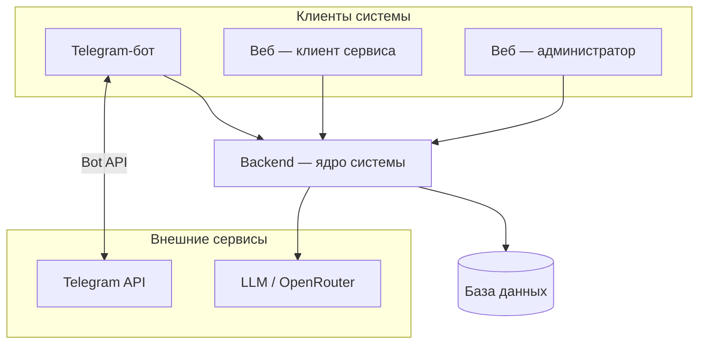
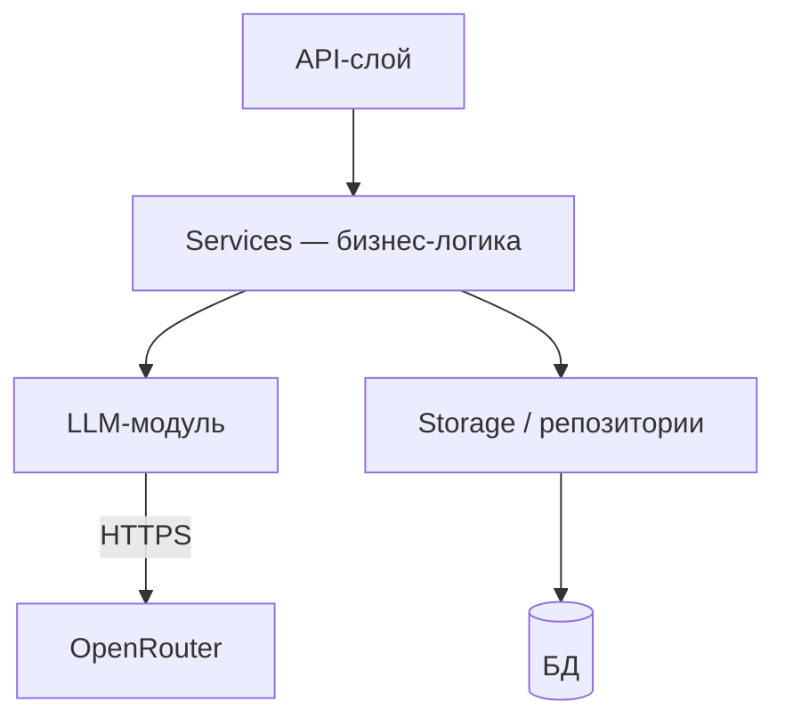
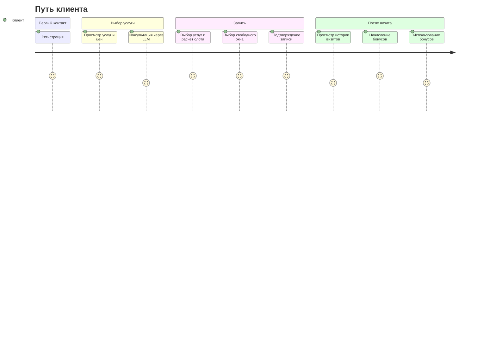

# Техническое видение проекта «Переобуйка»

Система автоматизирует работу шиномонтажного сервиса: ведёт прайс, рабочий календарь, записи клиентов, выполненные услуги и программу лояльности. Клиент получает удобный способ проконсультироваться и записаться; сервис — прозрачный учёт и сокращение ручной нагрузки на администратора.

Принципы разработки: **KISS · YAGNI · DRY**, ООП — один публичный класс на файл, без оверинжиниринга.

---

## 1. Границы системы

**«Переобуйка»** — это не только Telegram-бот. Это комплексная система, где:

- **Telegram-бот** — первый и приоритетный канал для клиента.
- **Веб-приложение** — единый frontend-проект с разными ролями: интерфейс клиента и интерфейс администратора.
- **Backend** — единое ядро, обслуживающее все каналы.



---

## 2. Архитектурные принципы

- **Backend — единое ядро.** Вся бизнес-логика живёт в одном серверном слое. Telegram-бот и веб-интерфейс — клиенты этого backend, не самостоятельные приложения с логикой.
- **Логика вычислений — в backend:** расчёт свободных слотов, определение длины слота по набору услуг, расчёт итоговой стоимости визита, начисление и списание бонусов.
- **LLM — консультант, не оракул.** Модель не придумывает цены и слоты — получает факты от backend и отвечает на их основе.
- **Масштабирование через каналы.** Новый канал (например, мобильное приложение) добавляется как новый клиент backend без изменения ядра.

---

## 3. Высокоуровневая архитектура

### Компоненты и их роли

| Компонент | Роль |
|-----------|------|
| **Telegram-бот** | Клиент backend; принимает сообщения пользователей через Telegram API, делегирует логику в backend |
| **Веб-приложение** | Клиент backend; единый frontend с ролями «клиент» и «администратор» |
| **Backend** | Ядро системы: бизнес-правила, расписание, прайс, лояльность, API для клиентов |
| **База данных** | Хранение всех доменных сущностей; SQLite — только локальная разработка; деплой — PostgreSQL |
| **LLM-компонент** | Внешний сервис (OpenRouter); отвечает на консультационные запросы на основе контекста от backend |

### Внутреннее устройство backend



- **API-слой** — принимает запросы от бота и веб-приложения; маршрутизирует к сервисам.
- **Services** — бизнес-правила: свободные слоты, расчёт длительности визита, стоимость, бонусы, фиксация услуг.
- **LLM-модуль** — системный промпт, формирование контекста из данных сервисов, вызов модели.
- **Storage** — репозитории с явными методами; смена СУБД изолируется здесь.

---

## 4. Роли и пользовательские сценарии

### Роли

| Роль | Описание |
|------|----------|
| **Клиент** | Автовладелец; взаимодействует через бота или веб-интерфейс клиента |
| **Администратор** | Сотрудник сервиса; использует административный веб-интерфейс |

### Сценарии клиента



| # | Сценарий | Каналы |
|---|----------|--------|
| 1 | **Регистрация** — первый контакт, создание профиля | Бот, веб |
| 2 | **Консультация** — вопросы об услугах, ценах, времени через LLM | Бот, веб |
| 3 | **Просмотр услуг и цен** — данные из backend, не из модели | Бот, веб |
| 4 | **Запись** — выбор услуг, расчёт длительности, выбор слота, подтверждение | Бот, веб |
| 5 | **Просмотр / отмена записей** — список предстоящих визитов | Бот, веб |
| 6 | **После визита** — фиксация факта услуг, начисление бонусов | Бот (уведомление), веб |
| 7 | **Лояльность** — баланс бонусов, списание и начисление по правилам | Бот, веб |

### Сценарии администратора

| # | Сценарий |
|---|----------|
| 1 | Управление прайсом: добавление/редактирование услуг, цен, длительностей |
| 2 | Управление рабочим расписанием и исключениями |
| 3 | Просмотр журнала записей и загрузки |
| 4 | Подтверждение факта выполненных услуг |
| 5 | Просмотр и корректировка бонусных счетов клиентов |

---

## 5. Доменные сущности

Ключевые понятия системы на уровне vision. Детали модели данных — в `docs/tech/data-model.md`.

| Сущность | Описание |
|----------|----------|
| **Пользователь** | Учётная запись в системе; может быть клиентом или администратором |
| **Клиент сервиса** | Пользователь с ролью клиента; история визитов, бонусный счёт |
| **Администратор сервиса** | Пользователь с правами управления системой |
| **Услуга** | Позиция прайса: название, цена, норма времени, активность |
| **Временной слот** | Отрезок времени в рабочем календаре; рассчитывается под набор услуг |
| **Запись** | Бронирование слота клиентом под конкретные услуги |
| **Визит** | Факт выполнения услуг: привязан к записи, подтверждается администратором |
| **Система лояльности** | Начисление бонусов после визита, списание в счёт следующих услуг |
| **FAQ** | База типовых вопросов и ответов, используемая LLM-компонентом |

---

## 6. Работа с LLM

- Провайдер: **OpenRouter** (`base_url` + `api_key` из конфигурации).
- Модель задаётся строкой в конфиге — менять без правок кода.
- **Роль модели** — консультант шиномонтажного сервиса. Модель не придумывает данные.
- **Контекст** — backend готовит и передаёт модели: актуальный прайс, свободные слоты, правила бонусов. Модель опирается исключительно на этот контекст.
- **Function calling** — только по необходимости (например, «оформить запись» как инструмент).
- Ошибки API и таймауты: логирование + понятное сообщение пользователю без утечки деталей.

```
КОНТЕКСТ (актуальные данные, подготовленные backend):
- Прайс: "Смена комплекта шин" — 2 500 ₽, 40 мин; "Балансировка" — 1 800 ₽, 30 мин.
- Свободные окна: 2026-04-08 15:00–16:10; 2026-04-08 17:30–18:40.
- Бонусы клиента: 320 бонусов; списание до 20% от суммы; начисление 5% после визита.
Ограничение: если ответа нет в контексте — уточни или предложи оформить запись.
```

---

## 7. Внешние интеграции

Детали — в `docs/tech/integrations.md`.

| Интеграция | Назначение |
|------------|------------|
| **Telegram Bot API** | Канал взаимодействия с клиентами через бота |
| **OpenRouter / LLM** | Консультационные диалоги на основе контекста |

---

## 8. Стек технологий

| Область | Выбор |
|---------|-------|
| Язык | Python 3.12+ |
| Зависимости | **uv** — `pyproject.toml` + lock-файл |
| Backend-фреймворк | **FastAPI** (ASGI); валидация и схемы — **Pydantic**; OpenAPI из кода (см. [ADR-002](tech/adr/adr-002-backend-framework.md)) |
| ORM / доступ к БД | **SQLAlchemy 2.x** (async), драйвер **asyncpg**; миграции — **Alembic** (см. [ADR-003](tech/adr/adr-003-orm.md)) |
| Telegram | **aiogram** 3.x, long polling (MVP); webhook при выделении HTTP-сервера |
| LLM-клиент | **openai** SDK (OpenRouter как провайдер) |
| БД | SQLite (только локальная разработка) → **PostgreSQL с первого деплоя** |
| Frontend | Определяется при старте web-фазы |
| Автоматизация | **GNU Make** (`Makefile`) |

---

## 9. Структура репозитория (целевая)

```
.
├── Makefile
├── README.md
├── bot/                    # Telegram-бот (aiogram), отдельный uv-проект
│   ├── pyproject.toml
│   ├── uv.lock
│   └── src/
│       └── pereobuyka/
│           ├── main.py     # точка входа, polling
│           ├── bot/        # handlers, router
│           └── config.py
├── backend/                # ядро системы
│   └── src/
│       └── pereobuyka/
│           ├── main.py     # точка входа API-сервера
│           ├── config.py
│           ├── services/   # бизнес-логика
│           ├── llm/        # LLM-клиент и промпты
│           ├── storage/    # репозитории, работа с БД
│           └── models/     # доменные модели (dataclass / pydantic)
├── web/                    # веб-приложение (frontend)
│   └── ...                 # стек определяется при старте web-фазы
├── tests/
└── docs/
    ├── idea.md
    ├── vision.md
    └── tasks/
└── tech/
    ├── data-model.md       # детали модели данных
    ├── integrations.md     # детали внешних интеграций
    ├── adr/                # архитектурные решения
    └── api/                # OpenAPI-контракт, коды ошибок
```

---

## 10. Конфигурирование и логирование

**Конфигурирование:**
- Все секреты и параметры среды — переменные окружения (`.env` для локальной разработки, не коммитить).
- Обязательные параметры: токен Telegram-бота, ключ OpenRouter, имя модели.
- Каждый компонент читает конфиг при старте, валидирует критичные ключи, падает с ясной ошибкой.

**Логирование:**
- Стандартный модуль `logging`; уровень из env.
- Не логировать: токены, ключи API, персональные данные без необходимости.
- Ошибки интеграций — с диагностичным контекстом, без тела секретов.

---

## 11. Архитектурные решения

Значимые решения фиксируются в формате ADR (Architecture Decision Record) — с контекстом, альтернативами и обоснованием.

Реестр и принципы ведения: [`docs/tech/adr/README.md`](tech/adr/README.md).

| # | Решение | Статус |
|---|---------|--------|
| [ADR-001](tech/adr/adr-001-database.md) | Выбор СУБД: PostgreSQL с первого деплоя | Accepted |
| [ADR-002](tech/adr/adr-002-backend-framework.md) | HTTP-фреймворк backend: FastAPI | Accepted |
| [ADR-003](tech/adr/adr-003-orm.md) | ORM и миграции: SQLAlchemy 2 async, Alembic | Accepted |

---

## 12. Открытые вопросы

| Вопрос | Статус |
|--------|--------|
| Frontend-стек (React / Vue / другой) | Определяется при старте web-фазы |
| Webhook vs. long polling для бота | Long polling на MVP; webhook при выделении сервера |
| Монорепо vs. отдельные репозитории | Монорепо до явной потребности в разделении |
| Деплой и инфраструктура | Вне текущего scope |
